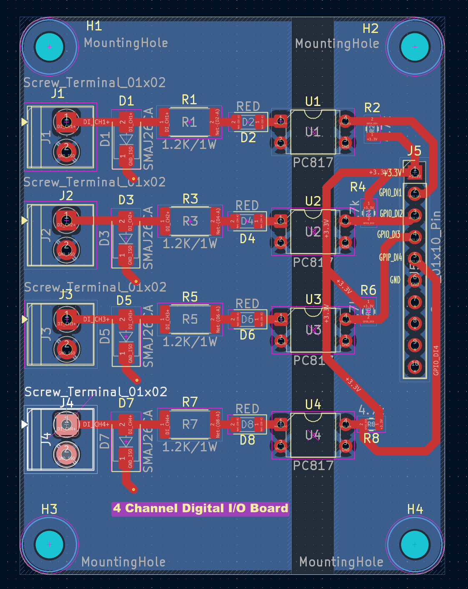

# 4-Channel Industrial Isolated Digital Input Board ⚡🏭

This repository contains the complete hardware design, production-ready Gerber files, and simulation models for a professional 4-channel isolated digital input card. It safely interfaces 24V industrial signals (from PLCs, proximity sensors, pushbuttons) with sensitive 3.3V/5V microcontrollers (like STM32, Arduino, or ESP32).

---

## 📸 Visuals & Renders

### 3D View of the Board

### Top Silkscreen & Track Routing

### Gerber Production Preview

---

## 📌 Project Overview
Industrial environments are full of electrical noise, voltage surges, and ground loops. This board provides complete galvanic isolation and transient protection for 4 independent input channels.

### Key Specifications:
- **Input Voltage:** 24V DC nominal (Field Side)
- **Output Logic:** 3.3V Active-Low (Logic Side)
- **PCB Dimensions:** 65mm x 50mm (2-Layer Board)
- **Software Used:** KiCad 8.0 (PCB Design) & LTspice (Circuit Simulation)

---

## 🛠️ Hardware Features & Architecture

### 1. Galvanic Isolation
- Uses **PC817 Optocouplers** to completely separate the 24V Field Circuit from the 3.3V Logic Circuit.
- Features a strict **5mm physical isolation trench** (Creepage distance) across the copper layers to ensure no electrical arcing occurs.

### 2. Circuit Protection
- **SMAJ24CA Transient Voltage Suppressor (TVS) Diodes** are placed directly at the input connectors to clamp high-voltage spikes and surges.
- Input current limiting via large **2512-packaged 1.2kΩ resistors** to safely handle thermal dissipation.

### 3. Visual Indicators
- Each channel includes a low-power **1206 status LED** for instant visual debugging on the factory floor.

---

## 📊 LTspice Simulation & Logic
Before layout execution, the circuit logic was thoroughly verified using **LTspice Transient Analysis**. 
- **Inverted Logic:** When a 24V input is detected (HIGH), the optocoupler transistor pulls the MCU pin to 0V (LOW). When the input is disconnected (LOW), the 4.7kΩ pull-up resistor pulls the pin to 3.3V (HIGH).

---

## 📁 Repository File Guide
*Click on the links below to view the source files directly inside GitHub:*

* 📄 **[Schematic File (.kicad_sch)](Industrial%204-Channel%20Isolated%20Digital%20Input%20Output%20Board.kicad_sch)** - Circuit schematics, component ratings, and connections.
* 🎛️ **[PCB Layout File (.kicad_pcb)](Industrial%204-Channel%20Isolated%20Digital%20Input%20Output%20Board.kicad_pcb)** - 2-layer track routing, ground planes, and component placements.
* 📦 **[Production Gerbers (.zip)](Gerbers.zip)** - Manufacture-ready fabrication files (Gerber + Drill data).
* 📁 **[Images Directory](/Images)** - Folder containing the 3D renders and layouts used in this readme.
